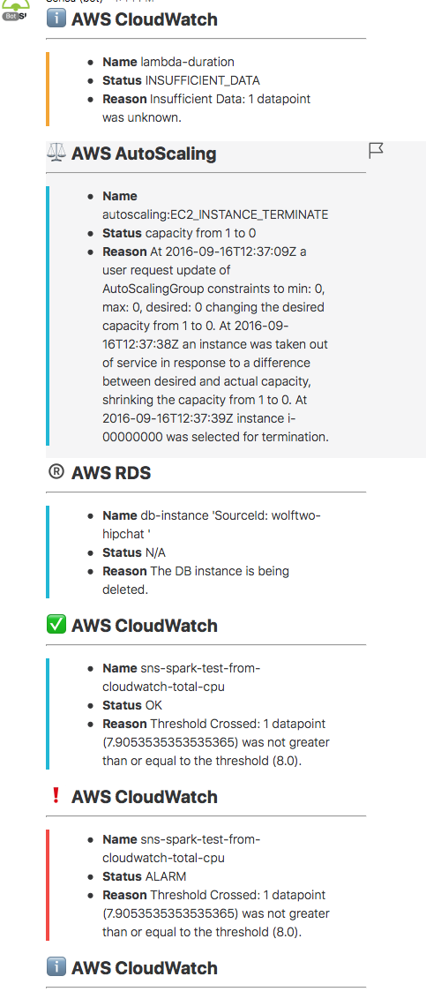

# aws-sns-webex-teams-terraform



This is a [Terraform](https://www.terraform.io/) module which maps an AWS SNS topic name to a Webex Teams channel.
The AWS Lambda function code it uses is derived from [robbwagoner/aws-lambda-sns-to-webex-teams](https://github.com/robbwagoner/aws-lambda-sns-to-webex-teams) and the terraform code is shameslly stolen / ported from [builtinnya/aws-sns-slack-terraform](https://github.com/builtinnya/aws-sns-slack-terraform).

The supported features are:

- Posting AWS SNS notifications to Webex Teams channels
- Building necessary AWS resources by Terraform automatically
- Customizable topic-to-channel map

## Usage

aws-sns-webex-teams-terraform is a [Terraform module](https://www.terraform.io/docs/modules/index.html).
You just need to include the module in one of your Terraform scripts and set up SNS topics and permissions.
See [examples/](/examples) for concrete examples.

```hcl
module "sns_to_webex_teams" {
  source = "github.com/builtinnya/aws-sns-webex-teams-terraform/module"

  webex_teams_bearer_token = "abc123"
  webex_teams_channel_map = "{\"production-notices\": \"Y2lzY29zcGFyazovL3VzL1JPT00vMDA2ZjYzNzAtMWJlOS0xMWU4LTljNTUtOTMzZmEzYWJkNjYy\"}"
  # The following variables are optional.
  lambda_function_name = "sns-to-webex-teams"

}

resource "aws_sns_topic" "testing_webex_teams_alarms" {
  name = "testingWebexTeams-notices"
}

resource "aws_lambda_permission" "allow_lambda_sns_to_webex_teams" {
  statement_id = "AllowSNSToWebexTeamsExecutionFromSNS"
  action = "lambda:invokeFunction"
  function_name = "${module.sns_to_webex_teams.lambda_function_arn}"
  principal = "sns.amazonaws.com"
  source_arn = "${aws_sns_topic.testing_webex_teams_alarms.arn}"
}

resource "aws_sns_topic_subscription" "lambda_sns_to_webex_teams" {
  topic_arn = "${aws_sns_topic.testing_webex_teams_alarms.arn}"
  protocol = "lambda"
  endpoint = "${module.sns_to_webex_teams.lambda_function_arn}"
}
```

### Configurable variables

|       **Variable**         |                          **Description**                          | **Required** | **Default**                    |
|:--------------------------:|:-----------------------------------------------------------------:|--------------|--------------------------------|
| **webex_teams_channel_map**      | Topic-to-channel mapping string in JSON.                          | yes          |                                |
| **lambda_function_name**   | AWS Lambda function name for the Webex Teams notifier                   | no           | `"sns-to-webex-teams"`               |
| **lambda_iam_role_name**   | IAM role name for lambda functions.                               | no           | `"lambda-sns-to-webex-teams"`        |
| **lambda_iam_policy_name** | IAM policy name for lambda functions.                             | no           | `"lambda-sns-to-webex-teams-policy"` |

### Output variables

| **Variable**            | **Description**                   |
|-------------------------|-----------------------------------|
| **lambda_function_arn** | AWS Lambda notifier function ARN. |

## Examples

### minimal

The minimal example is located at [examples/minimal](/examples/minimal).
It builds no extra AWS resources except a CloudWatch alarm for AWS Lambda's duration metric.

#### Building steps

1. Move to the [examples/minimal](/examples/minimal) directory.

    ```bash
    $ cd examples/minimal
    ```

2. Copy `secrets.tfvars.example` to `secrets.tfvars` and fill in the values.

    ```bash
    $ cp secrets.tfvars.example secrets.tfvars
    $ # Edit secrets.tfvars using your favorite editor.
    ```

    ```hcl
    region = "<region>"
    webex_teams_bearer_token = "abc123"
    ```

3. Execute the following commands to build resources using Terraform.

    ```bash
    $ terraform init
    $ terraform plan -var-file=terraform.tfvars -var-file=secrets.tfvars
    $ terraform apply -var-file=terraform.tfvars -var-file=secrets.tfvars
    ```

#### Destroying resources

To destory AWS resources created by the above steps, execute the following command in `examples/minimal` directory.

```bash
$ terraform destroy -var-file=terraform.tfvars -var-file=secrets.tfvars
```

#### Testing

To test notification, use [`awscli cloudwatch set-alarm-state`](http://docs.aws.amazon.com/cli/latest/reference/cloudwatch/set-alarm-state.html) as following.

```bash
$ AWS_ACCESS_KEY_ID=<ACCESS_KEY> \
  AWS_SECRET_ACCESS_KEY=<SECRET> \
  AWS_DEFAULT_REGION=<REGION> \
    aws cloudwatch set-alarm-state \
      --alarm-name lambda-duration \
      --state-value ALARM \
      --state-reason xyzzy
```

## Development

The main AWS Lambda function code is located in [sns-to-webex-teams/](/sns-to-webex-teams) directory.
To prepare development, you need to create [virtualenv](https://virtualenv.pypa.io/en/stable/) for this project and install required pip packages as following.

```bash
$ virtualenv sns-to-webex-teams/virtualenv
$ source sns-to-webex-teams/virtualenv/bin/activate
$ pip install -r sns-to-webex-teams/requirements.txt
```

You need to create [module/lambda/sns-to-webex-teams.zip](/module/lambda/sns-to-webex-teams.zip) to update the code as following.

```bash
$ source sns-to-webex-teams/virtualenv/bin/activate # if you haven't yet
$ ./build-function.sh
```

### Testing

To test the function locally, just run [lambda_function.py](/sns-to-webex-teams/lambda_function.py) with some environment variables.

```bash
$ WEBEX_TEAMS_BEARER_TOKEN="abv123" \
  CHANNEL_MAP=`echo '{"production-notices": "Y2lzY29zcGFyazovL3VzL1JPT00vMDA2ZjYzNzAtMWJlOS0xMWU4LTljNTUtOTMzZmEzYWJkNjYy"}' | base64` \
  python sns-to-webex-teams/lambda_function.py
```

## Contributors

See [CONTRIBUTORS.md](./CONTRIBUTORS.md).

## License

Copyright © 2018 John Dyer

Distributed under the Apache license version 2.0. See the [LICENSE](./LICENSE) file for full details.
